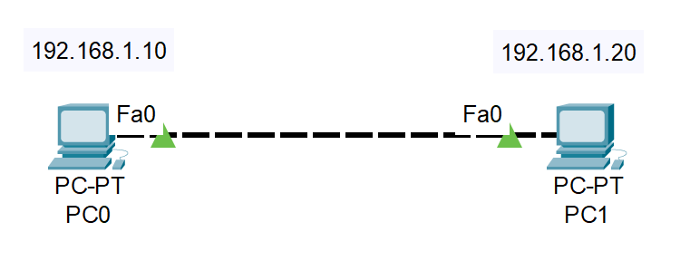
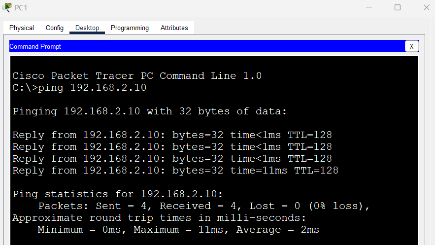

# Lab2_CableCrossover

## Objetivos

- Aprender a conectar dos PC.

## Topología

## Pasos
1. Arrastra dos PC.

2. Usa un cable Copper Straight-Through.

3. Conecta las PC en FastEthernet0 

4. Configuración de la PC0 : 
    - IP : 192.168.2.10 
    - Máscara : 255.255.255.0
    
    

5. Configuración de la PC1 :
    - IP : 192.168.2.20 
    - Máscara : 255.255.255.0
    
    

6. Haciendo ping de PC0 a PC1

7. Haciendo ping de PC1 a PC0

## Resultados

