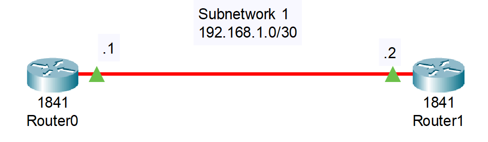
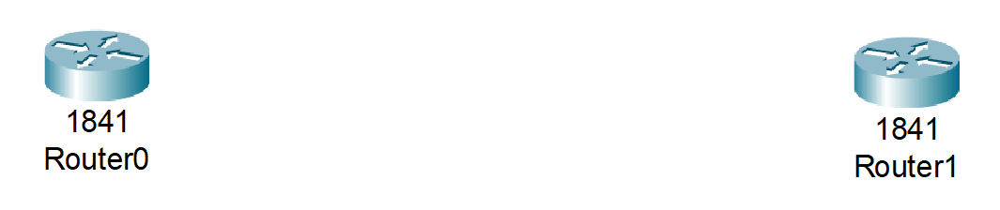
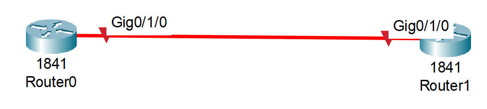
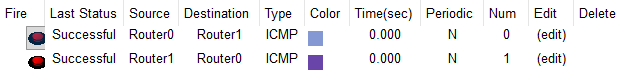

# 03_LAB_Cable_Fibra

## Objetivos
- El objetivo principal es familiarizarse con la conexión física y la configuración lógica de los enlaces de fibra óptica en Packet Tracer, verificando la conectividad de alta velocidad entre dos dispositivos de red.
- 
## Topologia

## Pasos

1. Arrastrar 2 switches 1841.
    

2. Ingresamos a Physical del Router 0, apagamos el dispositivo y agregamos el modulo de HWIC-1GE-SFP, junto con el modulo de GLC-LH-SMD y prendemos el dispositivo, igualmente se hace lo mismo en el Router 1.
    

3. Usar la conexion Fiber para hacer la conexion entre los 2 routers, en los puertos Gig0/1/0
    
    

4. Nuestra subred es 192.168.1.0/30, la primera IP usable es 192.168.1.1 y la segunda 192.168.1.2 con la máscara de subbred 255.255.255.252.
   
5. Configuracion del Router 0:
    - enable
    - configure terminal
    - interface GigabitEthernet 0/1/0
    - ip address 192.168.1.1 255.255.255.252
    - no shutdown
    - end
    - write memory
  
6. Configuración del Router 1:
    - enable
    - configure terminal
    - interface GigabitEthernet 0/1/0
    - ip address 192.168.1.2 255.255.255.252
    - no shutdown
    - end
    - write memory
  
## Resultados
