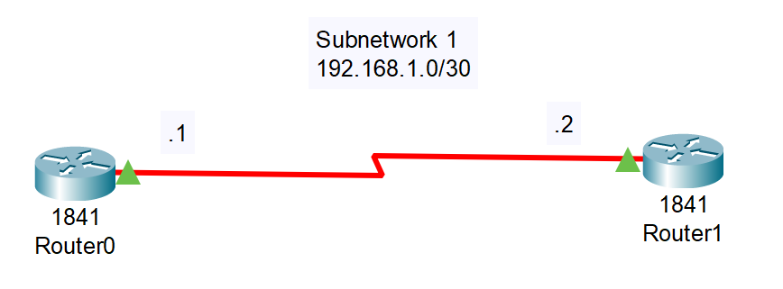
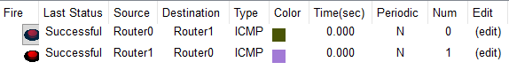

# 04_LAB_Cable_Serial_Dce_Dte

## Objetivos
- Aprender a conectar un cable Serial DCE y DTE

## Topología

## Pasos
1. Arrastrar 2 routers 1841.
   

2. Ingresamos al Router 0, en la pestaña de Physical, apagamos el dispositivo y agregamos el modulo HWIC-2T y volvemos a prender el dispositivo, haremos lo mismo con el Router 1.

3. Con la conexión DCE se la pondremos al Router 0 en serial 0/1/0 y el otro lado de la conexión se coloca en el serial 0/1/0 del Router 1.

4. Nuestra subred es 192.168.1.0/30, la primera IP usable es 192.168.1.1 y la segunda 192.168.1.2 con la máscara de subbred 255.255.255.252.
   
5. Configuracion del Router 0 (DCE):

- enable
- configure terminal
- interface serial 0/1/0
- ip address 192.168.1.1 255.255.255.252
- clock rate 64000
- no shutdown

6. Configuracion del Router 1 (DTE):

- enable
- configure terminal
- interface serial 0/1/0
- ip address 192.168.1.2 255.255.255.252
- no shutdown

## Resultados

