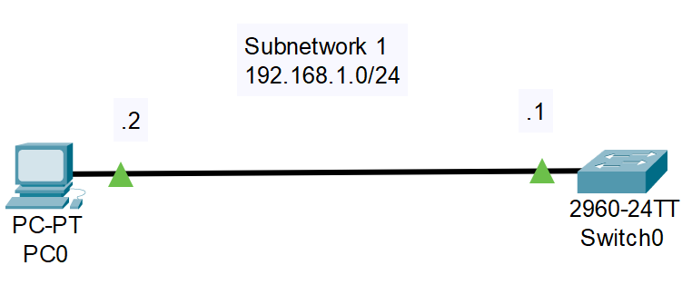
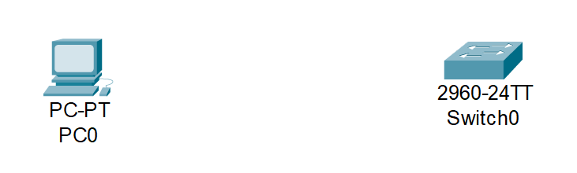
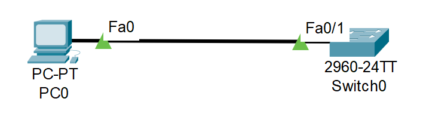
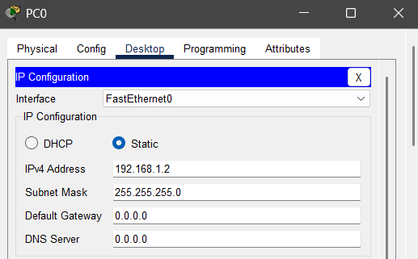
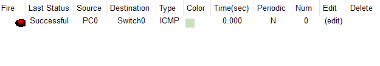

# 05_LAB_Conexion_Pc_Switch

## Objetivos

- Aprender a conectar una PC a un Switch

## Topología

  

## Pasos
  
1. Arrastrar una PC y un Switch 2960 IOS15

  

2. Usar la conexión Copper Straight-Through

  

3. En la PC0 conectaremos a FastEthernet0 y en el Switch FastEthernet 0/1

  

4. Utilizaremos la subred 192.168.1.0/24

5. Configuración PC0:

6. Configuración Switch 0

- enable
- configure terminal
- interface vlan 1
- ip address 192.168.1.1 255.255.255.0
- no shutdown

## Resultados

