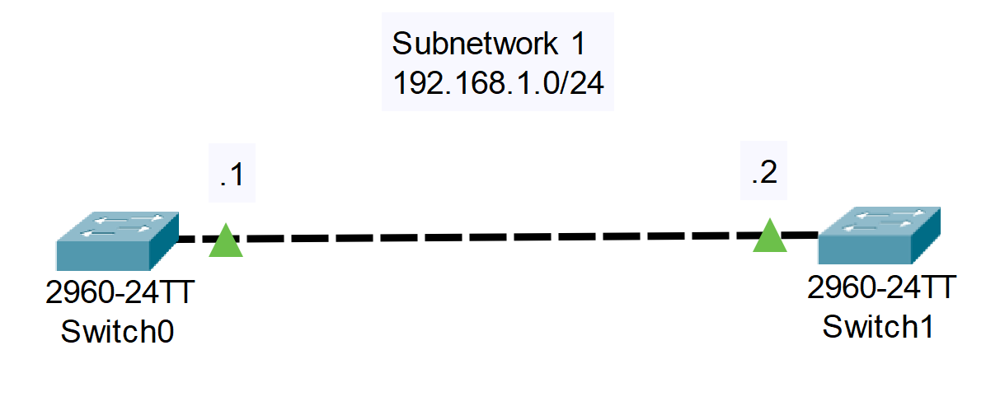
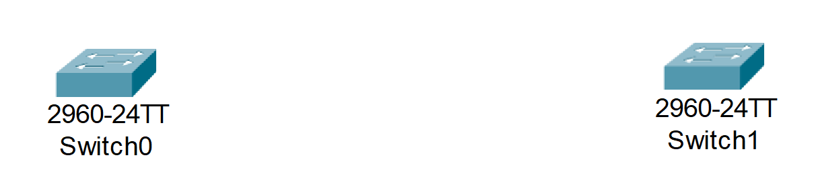
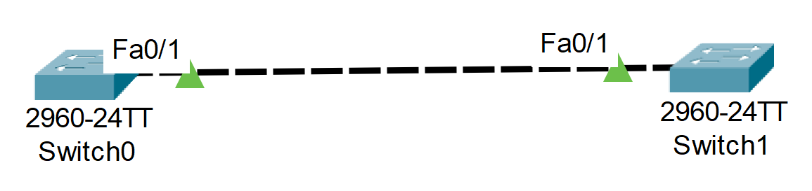
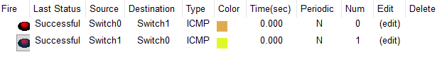

# 05_LAB_Conexion_Pc_Switch

## Objetivos

- Aprender a conectar 2 Switches

## Topología

## Pasos
  
1. Arrastrar 2 Switches 2960 IOS15

2. Usar la conexión Copper Cross-Over

3. En el Switch0 conectaremos a FastEthernet0/1 y en el Switch1 FastEthernet 0/1

6. Utilizaremos la subred 192.168.1.0/24

4. Configuración Switch 0

- enable
- configure terminal
- interface vlan 1
- ip address 192.168.1.1 255.255.255.0
- no shutdown
   
5. Configuración Switch 1

- enable
- configure terminal
- interface vlan 1
- ip address 192.168.1.2 255.255.255.0
- no shutdown

## Resultados

