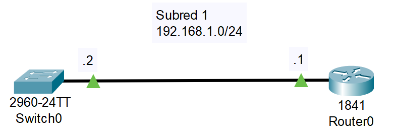
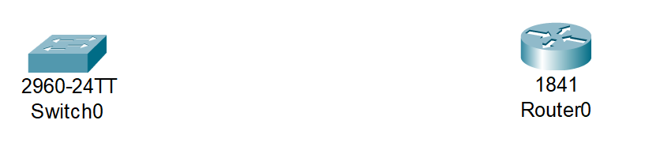
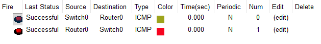

# 08_LAB_Conexion_Router_Switch

## Objetivos
- Aprender a conectar un Router a un switch

## Topología

## Pasos
1. Arrastrar un Switch 2960 IOS15 y un router 1841.
   

2. Utilizaremos la conexión Copper Straight-Through

3. En el Router 0 lo conectaremos a FastEthernet 0/0 y al Switch a FastEthernet 0/1

4. Utilizaremos la Subred 192.168.1.0/24, al Router en FastEthernet 0/0 le asignaremos la IP 192.168.1.1 y al Switch en FastEthernet 0/1 le asignaremos la IP 192.168.1.2

5. Configuración del Router0

- enable
- configure terminal
- interface fastEthernet 0/0
- ip address 192.168.1.1 255.255.255.0
- no shutdown

6. Configuración del Switch0

- enable
- configure terminal
- interface vlan 1
- ip address 192.168.1.2 255.255.255.0
- no shutdown

## Resultados

