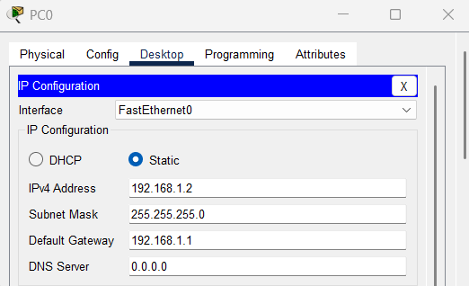
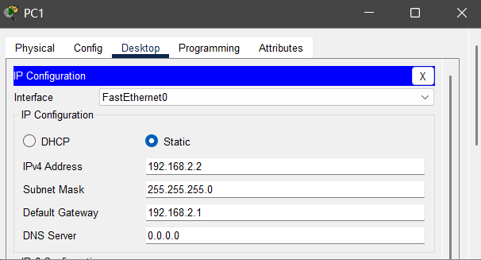
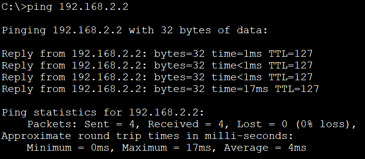
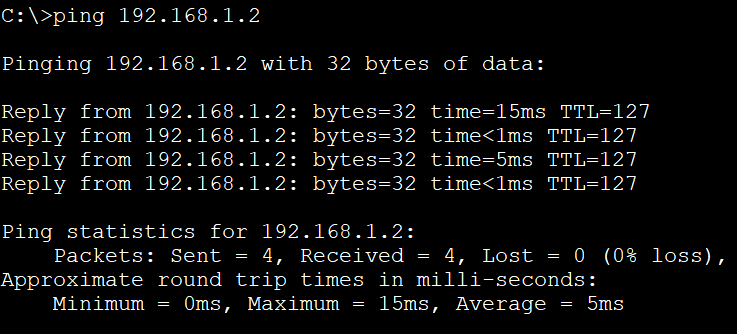

# 09_LAB_Prueba_de_ping_basico

## Objetivos
- Aprender a hacer una prueba de ping

## Topología

  

## Pasos
1. Agregamos 2 PC y un Router 1841

  

2. Con la conexion Copper Cross-Over conectaremos la PC0 al Router en el puerto fastEthernet 0/0 y de la PC1 al puerto fastEthernet 0/1

3. Asignaremos de PC0 al Router la Subred 1 192.168.1.0/24 Y de la PC1 al Router la Subred 2 192.168.2.0/24

4. Configuracion PC0

  

5. Configuracion PC1

  

6. Configuracion del Router para Subred 1

- enable
- configure terminal
- interface fastEthernet 0/0 
- ip address 192.168.1.1 255.255.255.0
- no shutdown

7. Configuracion del Router para Subred 2

- enable
- configure terminal
- interface fastEthernet 0/1 
- ip address 192.168.2.1 255.255.255.0
- no shutdown

8. Haremos una prueba de ping desde PC0 a PC1, iremos a la pestaña de Desktop, en la parte de Command Prompt, pondremos el siguiente comando y nos aparecerá lo siguiente

- ping 192.168.2.2
  
  

9. De igual forma de PC1 a PC0

- ping 192.168.1.2

  

## Resultados

Asi obtenemos una conexión exitosa de extremo a extremo

