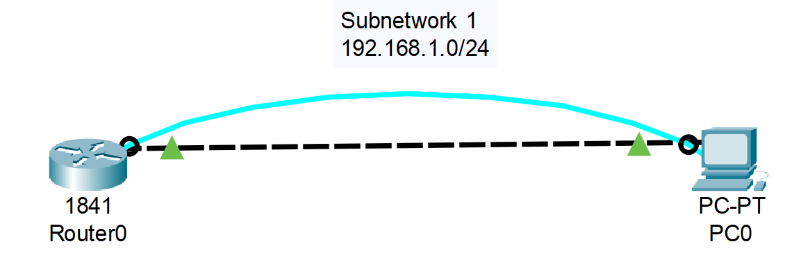
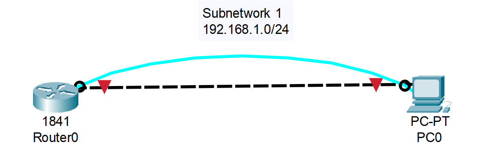
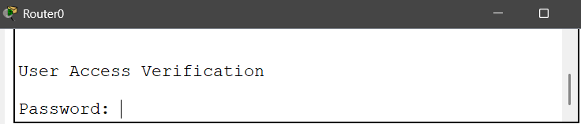
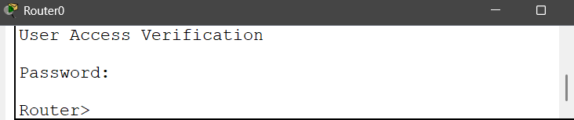
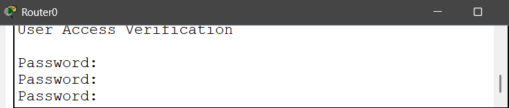
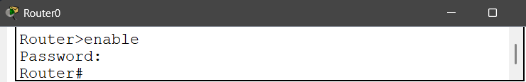
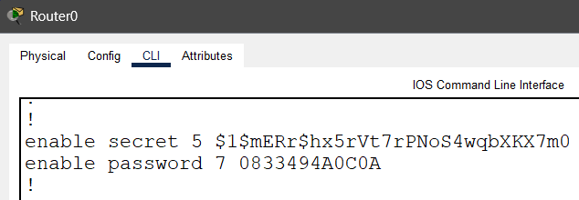

# 01_LAB_CLI_modos_y_contrasenas

## Objetivos

- El objetivo principal de este laboratorio es que se adquiera la habilidad de navegar por los modos de operación de la Interfaz de Línea de Comandos (CLI) de Cisco, establecer las contraseñas de acceso (Console, VTY y Enable), y utilizar las mejores prácticas para asegurar la configuración (cifrado de contraseñas).

## Topología

  

## Configuraciones

- Para empezar conectamos el cable de consola, lo conectaremos en Router en el puerto Console y en la PC en el puerto RS 232, tambien se puede hacer sin el cable de consola teniendo acceso a CLI del dispositivo, pero en el campo real se debe de ocupar.

  

### Contraseña de Acceso de Usuario (Consola y VTY)

Para asegurar la conexión física (Consola) en este caso nuestra contraseña será "cisco":
- enable
- configure terminal
- line console 0
- password cisco 
- login
- exit

Asegura la conexión remota (VTY - Telnet/SSH) : 
- enable
- configure terminal
- line vty 0 4
- password cisco
- login
- exit

Si queremos ingresar de nuevo al CLI del Router nos aparecerá lo siguiente:

  

Al ingresar la contraseña no aparecerá que estamos escribiendo.

Si la ingresamos de forma correcta :

  

Si la ingresamos de forma incorrecta nos indicará que la ingresemos de nuevo : 

  

### Contraseña del Modo Privilegiado (Enable)

Contraseña cifrada (mejor práctica) : 

- enable
- configure terminal
- enable secret cisco

ó

Contraseña no cifrada (solo para fines de prueba)

- enable
- configure terminal
- enable password cisco

  

### Cifrado de Contraseñas (Mejor Práctica)

Cifra todas las contraseñas que están en texto plano (como las de Console y VTY) :

- enable
- configure terminal
- service password-encryption

### Guardar la Configuración

Guarda los cambios de forma permanente:

- enable 
- copy running-config startup-config

## Resultados y verificación

### Verificar el Cifrado

- enable
- show running-config

La línea enable secret debe mostrar una cadena cifrada con MD5 (algoritmo de encriptación), y las contraseñas de line console y line vty deben estar cifradas si se aplicó service password-encryption.

  
  

### Verificar Contraseñas de Acceso

- Salir con el comando "exit"
- Intentar acceder al router, pedirá contraseña de la consola "cisco".
- Intentar acceder al modo privilegiado, pedirá contraseña "cisco".

