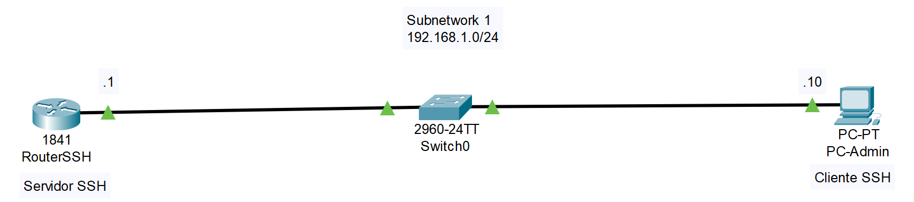
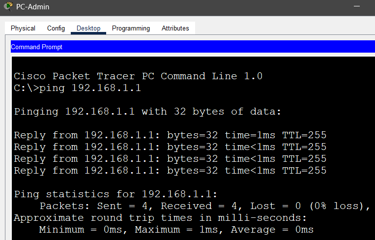
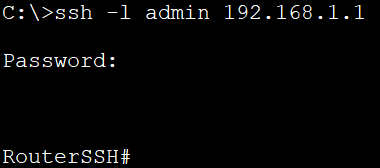
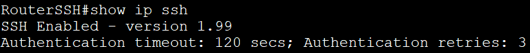
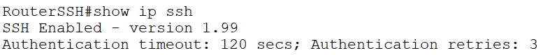

# 02_LAB_Acceso_Remoto_SSH

## Objetivo
- El objetivo de este laboratorio es que se adquiera la habilidad de configurar el acceso remoto seguro (SSH) en un dispositivo de red (Router), generando claves criptográficas y creando un usuario local, para luego acceder al dispositivo de forma remota desde una PC.

## Topología

## Configuración del Router (Servidor SSH)

1. Configuración Router (servidor SSH) :

- enable
- configure terminal
- hostname RouterSSH
- interface fastEthernet 0/0
- ip addres 192.168.1.1 255.255.255.0
- no shutdown
- exit

Requisitos de Seguridad y SSH :

2. SSH requiere tres elementos esenciales: 

- nombre de dominio
- usuario local
- generación de claves criptográficas (RSA)

3. Establecer Nombre de Dominio (Obligatorio para SSH) : 

- enable 
- configure terminal
- ip domain-name lab.local

4. Crear un usuario local y contraseña :

- enable 
- configure terminal
- username admin privilege 15 secret adminpass

5. Generar Claves Criptográficas (RSA):

Un tamaño de clave de 1024 o 2048 bits se recomienda por seguridad.

- enable
- configure terminal
- crypto key generate rsa

6. Habilitar y Configurar SSH en las Líneas VTY (Líneas de acceso remoto) :

- enable
- configure terminal
- line vty 0 4
- transport input ssh
- login local
- exit

7. Configurar tiempo de espera (Opcional, pero buena práctica) :

- enable
- configure terminal
- exec-timeout 10 0
- end
- write memory

## Acceso Remodo (Cliente SSH)

1. Ingresar a la PC-Admin.

2. Ve a la pestaña Desktop y selecciona Command Prompt.

3. Verificación Previa (Ping): Asegúrate de que hay conectividad IP antes de intentar SSH :

- ping 192.168.1.1

    

4. Acceso SSH: Utiliza el comando ssh -l [usuario] [dirección IP] :

- ssh -l admin 192.168.1.1
- Contraseña : adminpass
    

## Resultados

1. Conexión exitosa :

- Resultado Esperado: El cliente SSH debe preguntar: Password:. Ingresa la contraseña (adminpass).
- Serás dirigido al modo privilegiado (debido a privilege 15 en la configuración del usuario).
- Mostrará el prompt: RouterSSH#.

    

2. Verificar configuración del Router :

- show ip ssh
- Resultado Esperado: Debes ver que la versión de SSH está activada

    
