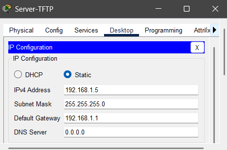
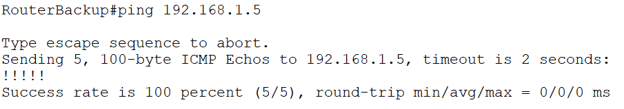
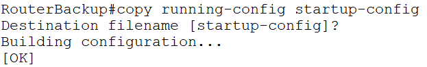
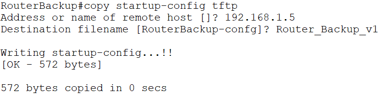
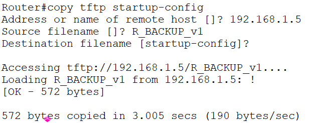
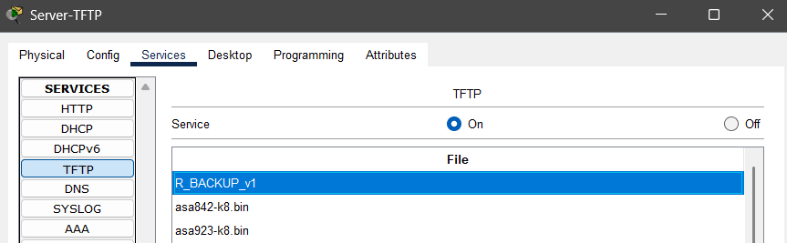

# 03_LAB_Guardar_Config_Archivos

## Objetivo

El objetivo de este laboratorio es que se adquiera la habilidad de administrar los archivos de configuración de un dispositivo Cisco, aprendiendo a:

Persistir la configuración (guardar de RAM a NVRAM).

Respaldar (back up) la configuración a un servidor externo (TFTP Server) como una medida de seguridad y recuperación ante desastres.

## Topología

## Pasos

1. Configuración del Router Backup :

- enable
- configure terminal
- hostname RouterBackup
- interface FastEthernet 0/0
- ip address 192.168.1.1 255.255.255.0
- no shutdown
- end

2. Configuración del Servidor
   

3. Verificar que el router tenga conexion al servidor TFTP

- ping 192.168.1.5

4. La configuración que se está haciendo se encuentra en Running Config (en RAM, volátil), si el router se apaga, se perdería la configuración. Se debe de guardar en Startup Configuration en (NVRAM, no volátil)

- copy running-config startup-config
  

5. Copiar la cofiguración guardada a un archivo del servidor en un archivo llamado Router_Backup_v1

6. Borrar la condiguración de inicio del router (simulación de algún accidente)

- erase startup-config

7. Recargar el router para que quede limpio

- reload

8. Configurar temporalmente la IP en el router para alcanzar el servidor

   

## Resultados

### Verificación del respaldo

En el Server-TFTP, en la pestaña Services -> TFTP , el archivo R_BACKUP_v1

### Verificación de la restauración
El router debe recuperar automáticamente su nombre y su configuración previa.

