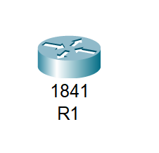
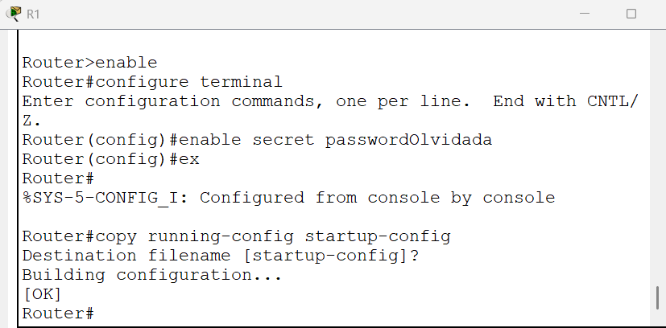
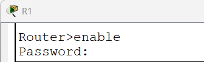
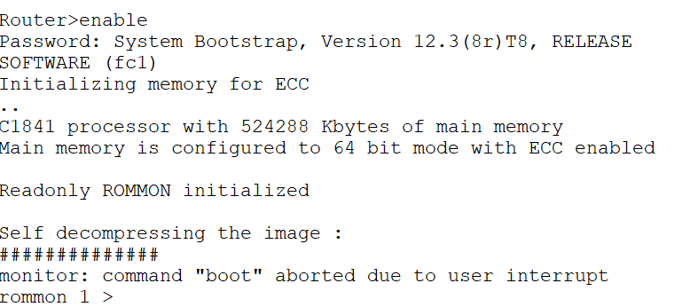
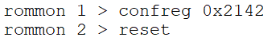
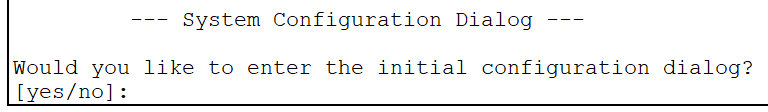
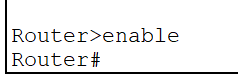
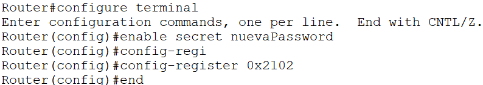
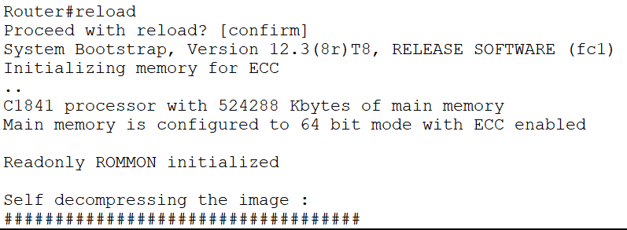
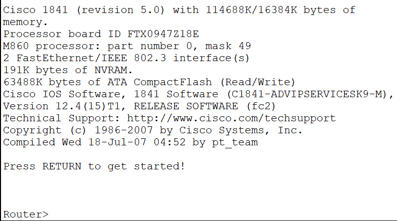

# 04_LAB_Password_Recovery

## Objetivo
El objetivo es recuperar el acceso a un router Cisco cuando la contraseña del modo privilegiado (enable) ha sido olvidada o perdida, sin borrar la configuración existente del dispositivo.

## Topología

## Pasos
   
1. Simularemos un bloqueo, pondremos una contraseña que "olvidaremos".

Si intentamos entrar al modo enable nos pedirá contraseña 

2. Interrumpiremos el arranque, reiniciaremos el router, iremos a la pestaña de Physical, lo apagamos y lo volvemos a encender, ramidamente iremos a la pestaña de CLI y daremos Ctrl + C

3. Nos aparecera esta leyenda de rommon 1 >

4. Cambiaremos el registro de configuración, el registro por defecto es 0x2102 y lo cambiaremos a 0x2142, que le dice al router que ignore la configuración de inicio

5. Diremos que no

6. Intentamos ingresar de nuevo al modo enable
   

7. Debemos cargar la configuración vieja para no perderla
   
   - copy startup-config running-config
  
8. Podemos poner una nueva contraseña 

- enable secret nueva_password

9.  Debemos regresar al registro de su valor original que es 0x2102

- config-register 0x2102
- end

10. Guardamos los cambios finales

- copy running-config startup-config

## Resultados

Reinicia el router una última vez con el comando : 

- reload

Resultado Esperado: El router debe cargar tu configuración anterior (nombres, IPs), pero ahora te permitirá entrar al modo enable usando la nueva_password que configuraste.

