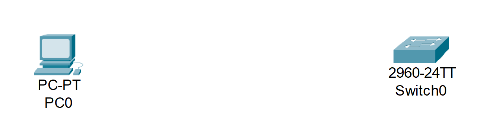
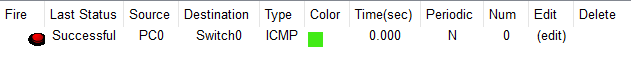

# Lab1_CableStraight

## Objetivos

- Aprender a conectar una PC y un Switch usando un cable directo.

## Topología

## Pasos
1. Arrastra una PC y un Switch 2960.

2. Usa un cable Copper Straight-Through.

3. Conecta la PC FastEthernet0 al Switch FastEthernet0/1

1. Configuración de la PC : 
    - IP : 192.168.1.10 
    - Máscara : 255.255.255.0
    
    

2. Configuración del Switch (en CLI):
    - enable
    - configure terminal
    - interface vlan 1
    - ip address 192.168.1.1 255.255.255.0
    - no shutdown
    

## Resultados

