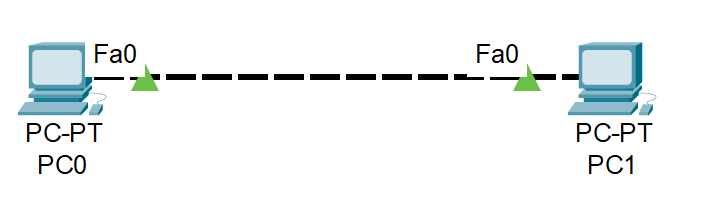
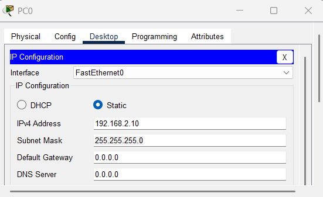
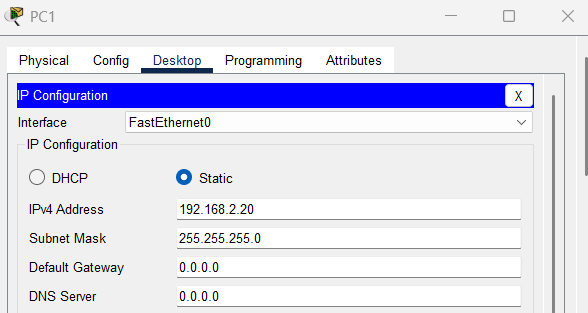
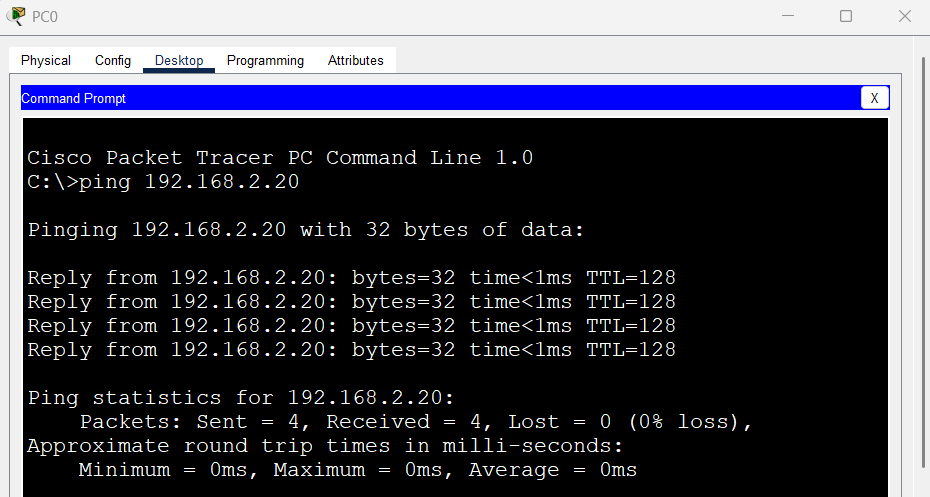

# LAB 2 – Cable Crossover

## Objetivo
Aprender a conectar dispositivos del mismo tipo usando un cable Crossover  
(p. ej., PC ↔ PC o Switch ↔ Switch cuando no hay puertos uplink automáticos).

## Topología


## Pasos

1. Arrastra dos PC al área de trabajo.  

   

3. Selecciona el cable **Copper Crossover**.

   

5. Conecta:
   - PC0 FastEthernet0 → PC1 FastEthernet0  

   
   

6. Configuración de la PC0
- IP: 192.168.2.10  
- Máscara: 255.255.255.0

     

5. Configuración de la PC1
- IP: 192.168.2.20  
- Máscara: 255.255.255.0

     

6. Verifica conectividad:

Desde PC0:
```bash
ping 192.168.2.20
```



Desde PC1:
```bash
ping 192.168.2.10
```


## Resultado
Ambas PCs deben poder hacerse ping entre sí usando un cable crossover.


